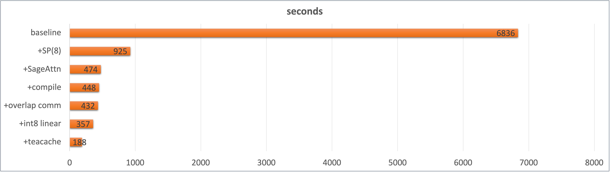

# DAX

DAX(Diffusion Accelerated eXecution) is an inference acceleration engine for diffusion models.

**Wall time for generating one video with Wan2.1 T2V 14B, 720p, 5s, 50steps, on Nvidia H20, with DAX**



Support:

- Quantization, including FP8/INT8 quantization for linear layers and SageAttention2 for attention quantization.
- Sequence parallelism with carefully tuned communication overlap.
- Teacache, accelerating DiT model inference by skipping trivial denoising steps. 
- torch.compile, which is crucial for achieving expected performance for above acceleration methods by fusing quantization and communication ops.


# Installation

## Local Installation

```bash
git clone https://github.com/RiseAI-Sys/DAX.git
cd DAX
pip install -e .
```

## Optional Dependencies

```bash
# [optional] fa2
pip install flash-attn

# [optional] fa3
git clone https://github.com/Dao-AILab/flash-attention.git 
cd flash-attention/hopper
python setup.py install

# [optional] SageAttention
git clone https://github.com/thu-ml/SageAttention.git
cd SageAttention 
python setup.py install
```

# Usage

`ATTENTION_BACKEND` can be `FLASH_ATTN`, which would use FA3 if installed, otherwise FA2. If `ATTENTION_BACKEND` is not set, DAX would use the vanilla torch SDPA.

for wan2.1, SageAttention is recommended.

```bash
export ATTENTION_BACKEND=SAGE_ATTN
torchrun --nproc_per_node=8 examples/wan_t2v_example.py \
    --model_id Wan-AI/Wan2.1-T2V-14B-Diffusers \
    --height 720 \
    --width 1280 \
    --output_file dax_wan_opt_video.mp4 \
    --sequence_parallel \
    --int8_linear \
    --overlap_comm \
    --enable_teacache \
    --compile
```

output video:


# Acknowledgement

We learned the design and resued some code from the following projects: [Wan2.1](https://github.com/Wan-Video/Wan2.1), [xDiT](https://github.com/xdit-project/xDiT), [Diffusers](https://github.com/huggingface/diffusers), [torchao](https://github.com/pytorch/ao) and [DeepSpeed](https://github.com/deepspeedai/DeepSpeed).
