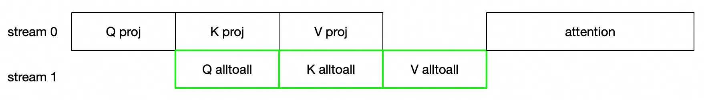
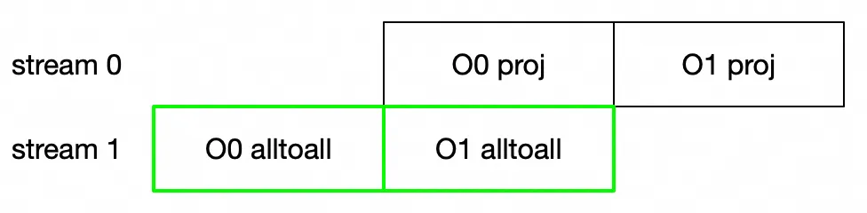

# Key Features

## Communication Overlap for Wan2.1

For wanx-2.1,  we adopt two communication overlap strategies. Through these strategies, we achieved an end-to-end speedup of 4% - 5%.

- We overlap the communication stream and computation stream for the q, k, v projections and all-to-all communication required by sequence parallel.

- We split the output projection in the sequence dimension and overlap their communication and computation.

